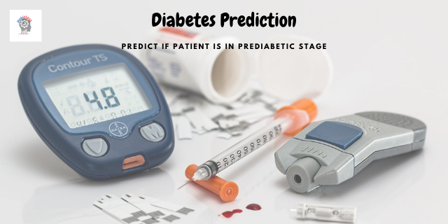

# Diabetes Prediction

In healthcare field diagnose a problem early offer more chance for traitement and guerison in this project we apply machine learning techniques to predict whether a patient will develop diabetes within the next five years. Early detection and diagnosis of diabetes is that the early stages of diabetes are often non-symptomatic. People who are on the path to diabetes (also known as prediabetes) often do not know that they have diabetes until it is too late.

## Contents

1. Project Structure
2. Prosess
3. How to run
4. Deployment (Real world Use)
5. To improve
6. About Me

## 1. Project Structure

#### Data
* ├── diabetes.csv
* ├── cleaned_data.csv
* ├── scaled_data.csv
* ├── data_documentation.pdf
#### analysis_and_training
* ├── py_files
* ├── 1_data_preprocessing
* ├── 2_ML_model
* ├── 3_DL_model
* ├── helpers.py
#### figures
* ├── contains graph and figures
#### models
* ├── contains trained models
#### images
* ├── contains images used in this images

##### environment
##### requirements.txt
##### gitignore
##### report (pdf & ppt)

## 2. Process

* step1 :  Importing Packages
* step2 :  Loading the data
* step3 : Exploratory Data Analysis (EDA)
* step4 : Data Preparation
* step5 : Build and Train the model
* step6 : Model prediction and Evaluation
* step7 : Model Improvement
 + Hyperparameter Tuning, Features Selection and Features Ingeneering
* step8 : Model Deployment

## 3. How to run

**N.B : python 3.7 is recommended**

### 3.1. CLONE PROJECT DIRECTORY

+ $ git clonehttps://github.com/RekidiangData-S/p01ml_diabetes_prediction.git
+ $ cd p01ml_diabetes_prediction

### 3.2. CREATE & ACTIVATE VIRTUAL ENVIRONMENT

#### 3.2.1. WITH PIP and VENV

##### (Windows) 
+ $ python -m venv p01ml_venv 
+ $ p01ml_venv\Scripts\activate (<= Activate virtual Environment)
+ $ deactivate (<= Deactivate virtual Environment)
+ $ pip install -r requirements.txt
+ Set  VIRTUAL ENVIRONMENT as KERNEL : 
  +  $ python -m ipykernel install --user --name p01ml_venv --display-name "p01ml_kernel"
+ $ jupyter notebook

##### (MasOS || LINUX)
+ $ python3 -m venv p01ml_venv 
+ $ source p01ml_venv/bin/activate (<= Activate virtual Environment)  
+ $ deactivate (<= Deactivate virtual Environment)
+ $ pip install -r requirements.txt
+ Set  VIRTUAL ENVIRONMENT as KERNEL : 
  +  $ python -m ipykernel install --user --name p01ml_venv --display-name "p01ml_kernel"
+ $ jupyter notebook

#### 3.2.2. WITH CONDA

+ Verify if you have conda installed ($conda --version) if not go to [anconda](https://www.anaconda.com/products/individual) or [miniconda](https://docs.conda.io/en/latest/miniconda.html) to download and install it

+ $ conda create -n p01ml_venv python=3.7
+ $ conda activate p01ml_venv (<= Activate virtual Environment)
+ $ conda deactivate  (<= Deactivate virtual Environment)
+ Set  VIRTUAL ENVIRONMENT as KERNEL : 
  +  $ python -m ipykernel install --user --name p01ml_venv --display-name "p01ml_kernel"
+ $ jupyter notebook
+ Go to Kernel -> Change kernel -> p01ml_kernel
+ $ jupyter kernelspec list (<= list all ipykernel in your system)
+ $ jupyter kernelspec uninstall p01ml_venv (<= Delete the ipykernel in your system)

#### Manage kernel
+ $ jupyter kernelspec list (<= list all ipykernel in your system)
+ $ jupyter kernelspec uninstall p01ml_venv (<= Delete the ipykernel in your system)

## 4. Deployment (Real world Use)

+ [Pre-diabetique prediction (WebApp with streamlit)](https://share.streamlit.io/rekidiang2/st01_diabetes_prediction/main/app.py)
+ [Pre-diabetique stage prediction (WebApp with flask)]()

___
## My name is Kiese Diangebeni Reagan
#### I'm **Data Science Analyst**, technology passionate person, Artificial Intelligence enthusiast and lifelong learner.
Let get in touch : <a href="https://kiese.tech">www.kiese.tech</a>

                                    
----
